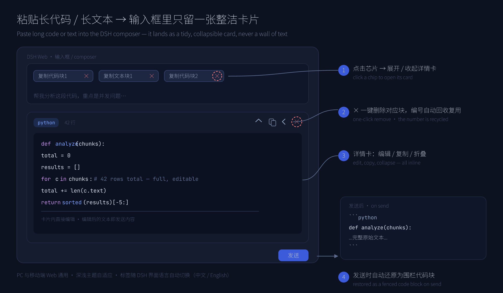
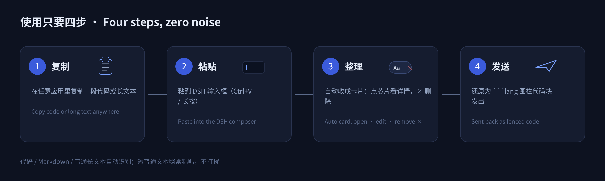
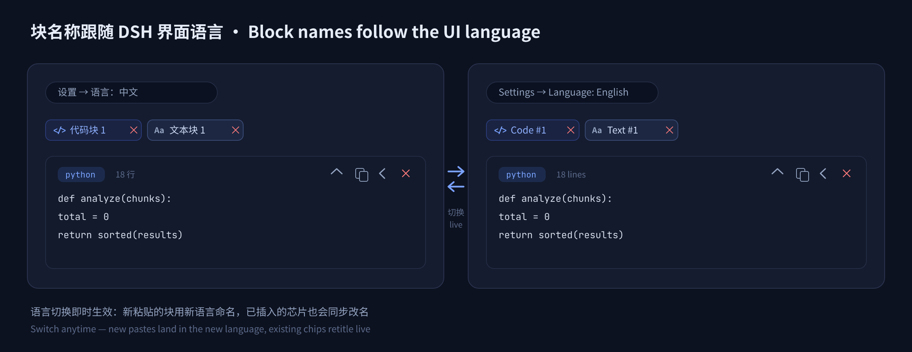

<div align="center">

# dsh-paste-code-block

**Cherry Studio 式的文本块/代码块粘贴效果（DeepSeek Harness Web）**

把复制的**长代码 / 长文本**粘到 DSH Web 输入框时，不再糊成一长串普通文字，而是收成一张**带边框、可折叠、带语言标签的卡片**；块名称自动跟随 DSH 界面语言（中文 / English）；发送时自动还原成真正的 ```` ```lang … ``` ```` 围栏代码块。

[](https://www.npmjs.com/package/dsh-paste-code-block)
[](./LICENSE)
[](https://github.com/deepseek-ai/deepseek-harness)

**[English](./README.md) | 中文**

</div>



## 为什么需要它

往聊天输入框里粘贴 200 行报错栈、API 返回、长日志，输入框立刻变成一坨无法阅读的文字墙。本插件把符合特征的粘贴折叠成 **芯片（chip）**（复用 DSH 自带的隐藏引用机制，与文件上传同源）外加一张**可编辑详情卡**——草稿保持整洁，内容随时可读、可改、可还原。

## 功能

- 🧩 **智能识别**：粘贴内容带 ``` 围栏、含换行、明显缩进、或长度 ≥ 96 → 收成卡片；普通短文本照常粘贴，绝不打扰。
- 🏷️ **语言标签**：自动识别 Python / JS / JSON / YAML / SQL / bash / HTML·XML / C++ / Go / Ruby 等（可识别 shebang）；纯文本块标为 `text`。
- ✏️ **卡片内编辑**：详情卡里直接修改内容，发送的正是编辑后的文本；另有复制、折叠/展开、收起。
- 🈯 **名称本地化**：芯片按当前 DSH 界面语言命名——`复制代码块1` / `Code block #1`、`复制文本块N` / `Text block #N`；在「设置 → 语言」切换后所有芯片即时改名。
- × **一键删除**：每个芯片自带 `×` 删除按钮（详情卡上也有）；删掉的块编号立刻回收复用。
- 📤 **发送还原**：发送时每个卡片展开还原为 ```` ```lang … ``` ```` 围栏代码块；发送失败自动回填输入框。
- 🔢 **智能编号**：代码与文本分开计数，永远分配最小可用号。
- 📱 **全端适配**：纯客户端插件，PC 与手机 Web 通用，实时跟随深浅主题。

## 工作流



## 名称本地化

芯片名称、按钮提示、行数、发送失效提示全部走 DSH 官方 locale 服务：插件注册自己的 `paste-code-block` 词典命名空间（zh / en 键集完全一致），输入坞声明该命名空间，因此切换语言时所有文案自动重渲染。



- **新粘贴**的块按粘贴时的界面语言命名。
- **已插入的芯片**在 设置 → 语言 切换后原地改名，无需刷新页面。
- 点击与删除**跨语言匹配**：切到英文后，原来叫 `复制代码块2` 的芯片（此时显示 `Code block #2`）依然指向同一个块，反之亦然。

## 安装

需要 DSH `0.1.x`（开发者预览版，接口可能变化）。已发布到 **npm**，直接按包名安装：

```sh
dsh plugin --profile web add dsh-paste-code-block
```

也可以从本仓库或本地目录安装：

```sh
dsh plugin --profile web add github:cjm-m/dsh-paste-code-block   # 从 GitHub
dsh plugin --profile web add file:/path/to/dsh-paste-code-block  # 从本地目录
```

安装后**重启 `dsh web`** 生效。

## 使用

1. 在任意地方复制一段代码 / 一段多行文本。
2. 在 DSH 输入框粘贴 → 折叠成 `复制代码块1` 这样的芯片。
3. 点芯片打开详情卡：阅读、就地编辑、复制、折叠；点芯片（或卡片）上的 `×` 删除该块。
4. 发送——完整原文以围栏代码块形式发出。

识别阈值：**含换行 / 行数 ≥ 2 / 长度 ≥ 96 / 缩进且符号密集 / 带围栏**，任一命中即成块。

## 说明与边界

- 块一律**追加在草稿末尾**（复用 DSH 隐藏引用语义），光标与撤销保持稳定。
- 纯文本块发送时用 ```` ```text ``` ```` 围栏包裹，不会在对话里糊成一行。
- 用其他方式删除芯片（如 `Backspace`）同样会释放编号——插件状态与编辑器持续对账。
- 删除单个块绝不影响其它块；删除是一次普通的编辑器编辑，可用 `Ctrl+Z` 撤销找回。
- 创建块**不会残留空格**：DSH 会在新插入的芯片后自动补一个分隔空格，插件只把这一个字符删掉——因此块后面接着输入的文字不会顶着一个前导空格，连续粘贴多个块也不会在正文里堆出多余空格；你自己敲的空格在粘贴/删除时都不会被动到。

## 目录结构

```
dsh-paste-code-block/
├── src/
│   ├── client.js       # Web（浏览器侧）—— 粘贴拦截、芯片、详情卡片、× 删除
│   ├── index.js        # Host（Node 侧）—— 有意为空（纯 UI 插件）
│   ├── parse.js        # 纯块识别逻辑（规范版，含单元测试）
│   └── i18n.js         # 词典与块名称解析（规范版，含单元测试）
├── tests/
│   ├── parse.test.js   # node:test 单元测试（src/parse.js）
│   └── i18n.test.js    # node:test 单元测试（src/i18n.js）
├── docs/
│   ├── design.md       # 设计说明（编号复用、锚点稳定、codec、i18n、芯片 ×）
│   └── images/         # README 示意图（PNG + 可编辑 SVG 源）
├── cordis.patch.yml    # DSH bundle patch，声明宿主插件
├── package.json        # 包与 DSH 插件清单
├── README.md           # English
└── README.zh-CN.md     # 简体中文
```

## 开发

```sh
npm run check   # 语法检查 JS 半端
npm test        # 运行单元测试（node:test，38 项）
```

## License

MIT — 见 [LICENSE](./LICENSE)。
